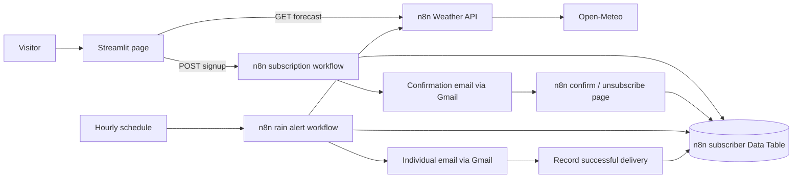

# Aalborg Rain

A Streamlit page for Aalborg weather and email subscriptions, with n8n as the backend.
The app is ready to deploy from this repository to Streamlit Community Cloud.

## Current status

- **Live:** weather API and confirmation/unsubscribe pages.
- **Built, awaiting Gmail:** signup and hourly email workflows. These are drafts, so no automated mail is sent yet.
- **Streamlit:** runs locally and is ready for your Cloud deployment. Signup stays disabled until you turn it on after Gmail is connected.

## Finish the Gmail connection

1. Open [Subscribe and confirm email](https://n8n.automate.business.aau.dk/workflow/SYTNugNIrptkh62u).
2. In **Send confirmation email**, create/select a Gmail OAuth2 credential and connect your Google account. On a self-hosted n8n instance, this may require a Google OAuth client first; follow [n8n's Gmail credential guide](https://docs.n8n.io/integrations/builtin/credentials/google/oauth-single-service/).
3. Open [Hourly rain email alerts](https://n8n.automate.business.aau.dk/workflow/BRMiLfN4j8kgyuBy) and select the **same credential** in **Send Aalborg rain alert**.
4. Publish both workflows. Weather and subscription management are already published.
5. Set `SUBSCRIPTIONS_ENABLED = true` in Streamlit Cloud secrets.
6. Subscribe with your own email on the app, confirm via the email link, and check the subscriber row is active and confirmed.

No Gmail credentials or MCP bearer token belong in GitHub or Streamlit. The app calls public n8n webhooks from its server.

## Deploy to Streamlit Community Cloud

In [Streamlit Cloud](https://share.streamlit.io/), choose **Create app** and deploy:

| Setting | Value |
|---|---|
| Repository | `RJuro/aalborg-rain-alerts` |
| Branch | `main` |
| Main file | `app.py` |
| Python | `3.12` or newer |

The weather page works with no secrets. For configuration, copy this into **Advanced settings → Secrets**, or **App settings → Secrets** after deployment:

```toml
N8N_BASE_URL = "https://n8n.automate.business.aau.dk"
SUBSCRIPTIONS_ENABLED = false
```

Change the flag to `true` after the Gmail setup above.

The repository is private. To allow anyone to view and subscribe, set the deployed app's sharing setting to **This app is public and searchable**. This does not require making your source repository public. See [deployment](https://docs.streamlit.io/deploy/streamlit-community-cloud/deploy-your-app/deploy), [secrets](https://docs.streamlit.io/deploy/concepts/secrets), and [sharing](https://docs.streamlit.io/deploy/streamlit-community-cloud/share-your-app).

The email links go directly to n8n, so they work regardless of the Streamlit app's final URL.

## What happens



Four workflows:

| Workflow | Link | State |
|---|---|---|
| Weather API | [Open](https://n8n.automate.business.aau.dk/workflow/3P56cGkOrHOerZpv) | Published |
| Subscribe and confirm email | [Open](https://n8n.automate.business.aau.dk/workflow/SYTNugNIrptkh62u) | Draft; Gmail needed |
| Confirm and unsubscribe | [Open](https://n8n.automate.business.aau.dk/workflow/Mh6WdYVSzFLWDYvl) | Published |
| Hourly rain email alerts | [Open](https://n8n.automate.business.aau.dk/workflow/BRMiLfN4j8kgyuBy) | Draft; Gmail needed |

Table: **Aalborg rain subscribers**, ID `hrGw9PmDUB003kIY`, in your personal n8n project.

## Rain rule

Every hour at minute 05, n8n checks whether an hourly forecast interval overlapping the next six hours has:

- precipitation probability **≥ 60%**;
- predicted rain plus showers **≥ 0.2 mm**.

Only active, confirmed subscribers receive alerts. There are at least six hours between alerts per subscriber. If rain remains likely for a long period, a further alert may arrive after that gap; this is a cooldown, not a rain-event identifier.

The page uses the same backend rule. Forecast data is cached for five minutes in Streamlit; the page rechecks on interaction, reload, or the refresh button. A stale or incomplete forecast is shown as unavailable.

Open-Meteo precipitation probability includes all precipitation, including snow. We additionally require forecast liquid rain/showers. Its percentage applies to a single hour, **not** the whole six-hour window. The hourly quantities describe the preceding hour, so the backend exposes explicit start/end intervals and keeps timestamps in UTC; the UI/email displays Europe/Copenhagen time, including daylight saving changes.

This uses an existing weather model forecast. It does not train a new supervised ML model. For a classroom extension, students could replace the forecast/score source with their own tabular classifier while retaining the subscription and action pipeline.

Weather attribution: [Open-Meteo](https://open-meteo.com/) and [API documentation](https://open-meteo.com/en/docs). The free endpoint is for non-commercial use; use the appropriate plan for a commercial deployment.

## API contracts

Base: `https://n8n.automate.business.aau.dk/webhook`

- `GET /aalborg-weather-v1`: normalized forecast, alert decision, threshold settings, and 24 hourly intervals.
- `POST /aalborg-rain-subscribe-v1`: JSON `email`, `consent: true`, `confirm_token`, `unsubscribe_token`. Streamlit generates distinct 32-byte cryptographic tokens encoded as 43 URL-safe characters. Success returns a generic 202 receipt without exposing subscription state or tokens. Pending signups receive no alerts.
- `GET /aalborg-rain-manage-v1?action=confirm|unsubscribe&token=...`: show an explicit action button.
- `POST /aalborg-rain-manage-v1`: form fields `action`, `token`; apply the action. Opening an email link alone changes nothing, protecting against email link scanners.

Confirmation links expire after 24 hours. Repeated requests for an active subscriber change nothing; pending confirmation messages are limited to once per 15 minutes for that address.

The public signup endpoint has input validation and per-address confirmation throttling. It is a small community/classroom implementation, not a high-volume newsletter platform: n8n Data Table upserts are not a unique email constraint, and the send-then-record sequence cannot guarantee exactly-once delivery if recording fails after Gmail accepts mail. Add ingress rate limits and stronger transactional delivery tracking before a large public launch.

## Local development

```sh
python3 -m venv .venv
source .venv/bin/activate
pip install -r requirements.txt
streamlit run app.py
```

Optional: copy `.streamlit/secrets.toml.example` to `.streamlit/secrets.toml`. The real secrets file is ignored by Git.

## Verification

```sh
python -m unittest discover -s tests -v
node tests/test_workflow_logic.cjs
```

Verified during setup:

- 12 Python tests: HTTP client failure handling, fresh/stale data, email/consent validation, secure token generation, signup feedback and page rendering.
- JavaScript checks of the actual n8n Code node logic: rain thresholds, forecast horizon, incomplete data, duplicate confirmation throttling, token expiry and unsubscribe behaviour.
- Live n8n weather API and Python client.
- Live confirmation and unsubscribe persistence using a synthetic address, removed after testing.
- Desktop and mobile page previews.

Actual Gmail delivery and scheduled email execution are not verified until Gmail is connected. The n8n fixture-test tool failed to start tests on this instance; local logic tests and live weather/management requests were used instead.

The `n8n/*.sdk.ts` files describe the workflows with n8n's Workflow SDK. `n8n/*.json` are n8n editor import snapshots for reference or recovery on this instance; they depend on the existing subscriber table and need a real Gmail credential.

